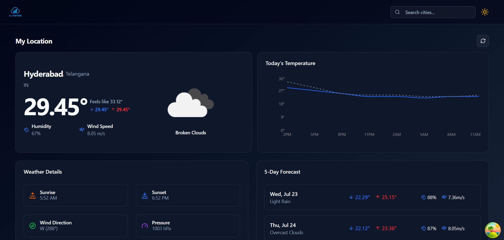

# 🌦️ Climetrik - Modern Weather App

**Climetrik** is a sleek, fast, and responsive weather application built with **React**, **Vite**, and **Tailwind CSS**, integrating real-time weather data using the **OpenWeatherMap API**. Designed for simplicity, speed, and mobile-first experience.

---

## 🔗 Live Demo

👉 [View Climetrik Live](https://your-deployment-url.vercel.app/)

---

## 📸 Screenshots

| Light Mode | Dark Mode |
|------------|-----------|
|  |  |

---

## 🚀 Features

- 🌍 Search weather by city
- ☀️ Real-time temperature, humidity, and wind speed
- 📆 5-day forecast with min/max temps
- 🌘 Dark and Light mode toggle
- 📱 Fully responsive (mobile-first design)
- 💨 Dynamic weather icons
- ⚡ Blazing-fast performance using Vite

---

## ⚙️ Tech Stack

| Technology    | Description               |
|---------------|---------------------------|
| React         | Front-end framework       |
| Vite          | Fast build tool & dev server |
| Tailwind CSS  | Utility-first CSS framework |
| OpenWeather API | Real-time weather data  |
| Shadcn/UI     | Styled UI components      |
| React Icons   | Weather and utility icons |

